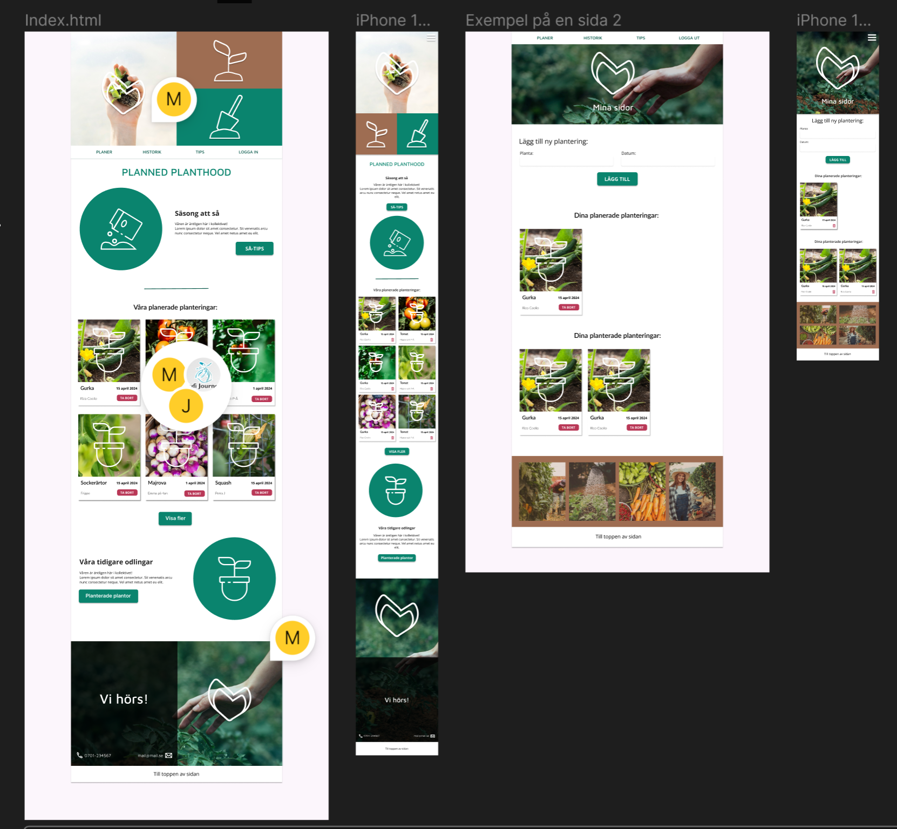

# Planned-Planthood

Skapa sida med HTML och CSS som har samma utseende som följande mall: <figure></figure>

## Projektbeskrivning

Planned Planthood är en gemensam odlingsplanerare för kollektivet. På startsidan får ni en tydlig överblick över säsongens sådder: vad som ska planteras, när det ska ske och vem som ansvarar. Varje plantering presenteras som ett kort med bild, datum och odlare, så att det blir lätt att fördela uppgifter och undvika dubbeljobb. Ni kan även bläddra i historiken för att se tidigare odlingar, spara lärdomar och hämta inspiration till nästa säsong.

Webbplatsen innehåller dessutom korta, handfasta så-tips som hjälper både nybörjare och vana odlare att lyckas. Allt är byggt med ett tydligt, responsivt gränssnitt som fungerar lika bra i mobilen på odlingslotten som på datorn hemma. Målet är att skapa ordning, förenkla samarbetet och göra det roligare att odla tillsammans från första frö till skörd.

## Tekniker som använts

- HTML: Semantik, struktur
- CSS: Layout, responsivitet
  -flexbox, grid & clamps

## Utmaningar & lösningar

- Utmanande att skapa en knapp för **mina sidor** där varje planta som skiljer sig åt utseendemässigt beroende på om man är på mobil eller inte.

  - På mobilen var det en ganska simpel lösning där varje listad planta är ett 2x3 grid och gick att applicera på alla 3 plantor.

  - På desktop var det mer utmanande då plantor under **planerade planteringar** och **planterade planteringar** skiljer sig åt med antal plantor. Lösningen på detta blev att hantera varje kategori olika i CSS. **planerade planteringar** görs om till ett 2x4 grid när media query triggras.

- Svårt att skapa en responsivitet när man zoomar in och ut mellan olika storlekar av enheter.

  - Lösning här blev att lära sig clamps som gör att vi kan styra minimum, rekommenderad och maximal storlek på t.ex. titlar och texter mm. Svårt att få till rekommenderad storlek då denna gärna får vara dynamisk och ofta gick det att köra vw som enhet i CSS.
 
- Svårt att effektivt jobba i samma HTML och CSS-filer.
  - Våran lösning var att föra mycket kommunikation mellan varandra i gruppen för att undvika konflikter i filerna.
